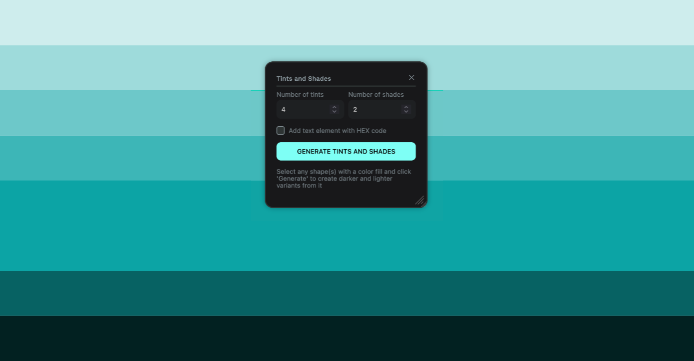

# Tints and Shades Penpot Plugin

Generate lighter and darker variations of any color

# Install on Penpot

Open the plugins modal in your Penpot project and add the next url

- https://penpot-tints-and-shades-plugin.netlify.app/manifest.json

Click install and you're setup!
